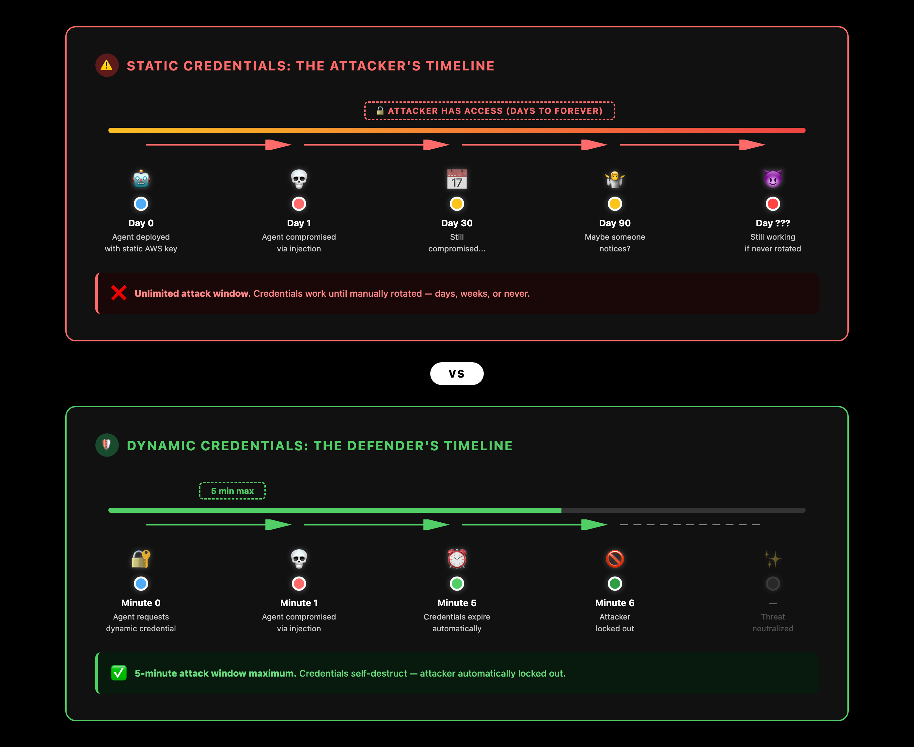
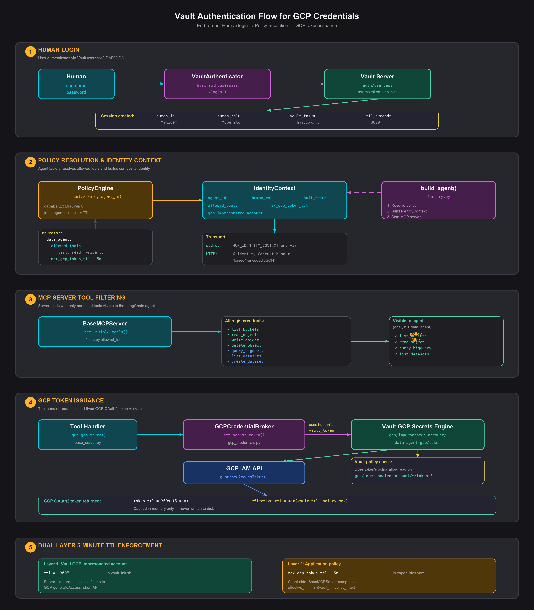
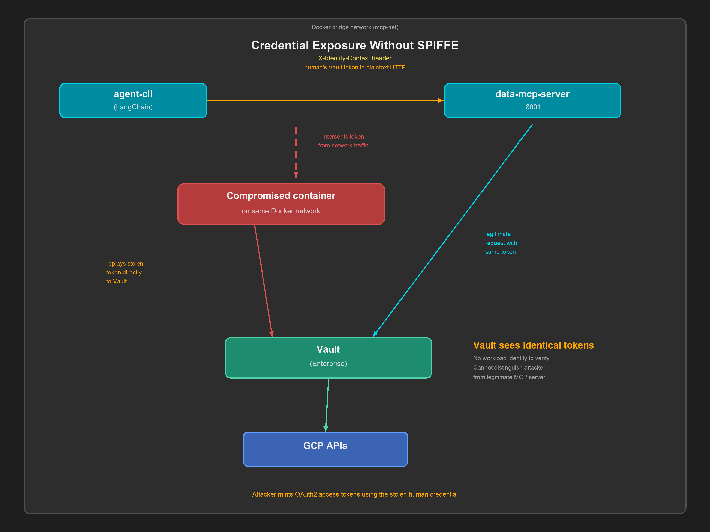
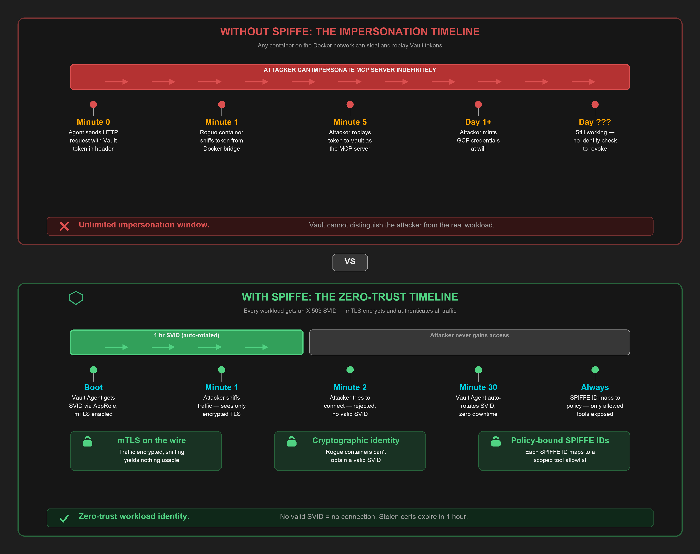
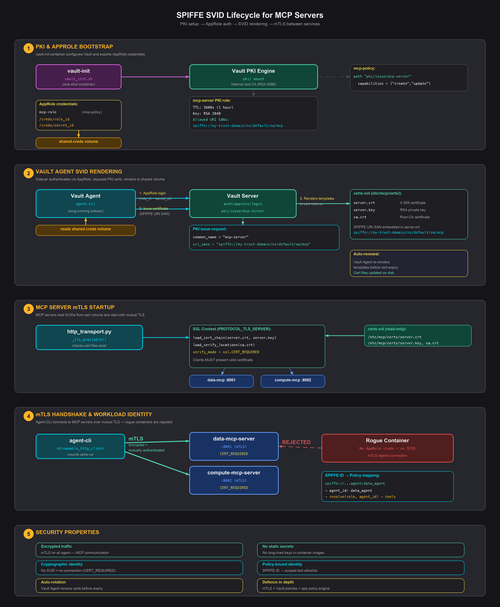
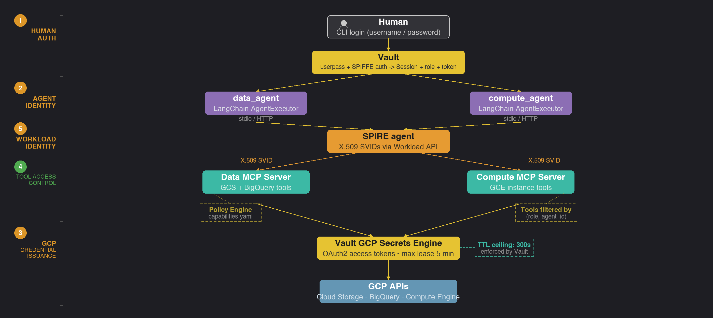

# vault-mcp-agents-spiffe

This repo demonstrates mitigations for three threats from the [OWASP Top 10 for Agentic Applications (2026)](https://genai.owasp.org/resource/owasp-top-10-for-agentic-applications-for-2026/) using HashiCorp Vault-brokered, 5-minute TTL GCP credentials:

| OWASP ID | Threat | How this repo mitigates it |
|---|---|---|
| **ASI03** | **Identity & Privilege Abuse** | Vault brokers all credentials — human auth, agent identity (AppRole), and GCP tokens are issued with a hard 5-minute TTL. No long-lived keys exist on disk. |
| **ASI02** | **Tool Misuse & Exploitation** | A YAML policy maps each `(human_role, agent_id)` pair to an explicit tool allowlist. The MCP server only exposes permitted tools, so an agent cannot invoke tools outside its scope. |
| **ASI10** | **Rogue Agents** | Short-lived credentials and per-agent tool scoping contain the blast radius — a compromised agent can only reach its allowed tools, and any stolen GCP token expires within minutes. |

**Note**

Despite the fact that the credentials brokered by Vault are for GCP, the principles that this repo illustrates work
equally well for both Azure and AWS also.

## Demonstration Scenario

Two LangChain agents call separate MCP servers, where each server's capabilities are gated by the **combined identity** of the calling agent and the authenticated human user. GCP credentials are brokered through HashiCorp Vault — no long-lived service account keys exist in the application.

## Why 5-minute credentials?

Long-lived GCP credentials are a common source of security incidents. A stolen OAuth2 token that is valid for an hour gives an attacker a wide window to exfiltrate data or provision resources. By capping the credential lease at 5 minutes, this project enforces a principle of **least-duration privilege**: every GCP token issued by Vault expires before an attacker could realistically discover and exploit it through lateral movement.

The diagram below shows the contrast. In the first scenario, a compromised agent holds a static credential that never expires - the attacker has unlimited time to enumerate resources, exfiltrate data, and pivot. In the second scenario, the same compromise yields a token that expires in 5 minutes, turning a persistent backdoor into a brief, bounded incident.

<p align="center">
  
</p>

The 5-minute ceiling is enforced at two independent layers, so both must agree before a token is issued:

| Layer | Configuration | What it controls |
|---|---|---|
| **Vault GCP impersonated account** | `ttl = "300"` on each impersonated account in `vault_init.sh` | Server-side ceiling — Vault passes this as the `lifetime` to GCP's `generateAccessToken` API, so the token genuinely expires after 5 minutes |
| **Application policy** | `max_gcp_token_ttl: "5m"` in `policies/capabilities.yaml` | Client-side guard — the application policy declares the intended maximum TTL for audit and defence-in-depth |

The diagram below shows the end-to-end authentication flow — from human login through policy resolution to GCP token issuance with the 5-minute TTL enforced at both layers:

<p align="center">
  
</p>

## Why SPIFFE Verifiable Identity Documents for MCP Server Identity?

Short-lived GCP credentials solve the *credential theft* problem, but they do not solve the *workload impersonation* problem. Even with 5-minute tokens, a compromised container on the same Docker bridge network can intercept the human's Vault token from plaintext HTTP traffic and replay it to Vault as if it were the legitimate MCP server. Vault has no way to distinguish the attacker from the real workload because neither presents a cryptographic identity.

<p align="center">
  
</p>

SPIFFE Verifiable Identity Documents (SVIDs) close this gap. Each MCP server receives a short-lived X.509 certificate from Vault's PKI engine, with a SPIFFE URI SAN (`spiffe://my-trust-domain/ns/default/sa/mcp`) embedded in the Subject Alternative Name field. This certificate serves three purposes:

1. **Mutual TLS (mTLS)** — all traffic between the agent CLI and MCP servers is encrypted and mutually authenticated. An attacker sniffing the Docker bridge sees only ciphertext.
2. **Cryptographic workload identity** — a rogue container cannot obtain a valid SVID because it does not have AppRole credentials to authenticate to Vault. Without a valid certificate, mTLS rejects the connection outright.
3. **Policy-bound identity** — the SPIFFE ID in the certificate maps to a scoped tool allowlist in `policies/capabilities.yaml`, so even if an attacker could somehow obtain an SVID, it would only grant access to the tools permitted for that specific workload.

The diagram below contrasts the two scenarios. Without SPIFFE, an attacker can impersonate an MCP server indefinitely. With SPIFFE, the attacker never gains access — mTLS blocks unauthenticated connections, SVIDs auto-rotate every hour, and stolen certificates expire before they can be exploited.

<p align="center">
  
</p>

The SVID lifecycle is fully automated by the Vault Agent sidecar — no manual certificate management is required. The diagram below shows the complete lifecycle: PKI bootstrap, AppRole authentication, SVID rendering, mTLS enforcement, and rogue container rejection:

<p align="center">
  
</p>

See the [SPIFFE Guide](docs/SPIFFE_GUIDE.md) for implementation details.


## What this project demonstrates

| Concern | How it's handled |
|---|---|
| Human authentication | Vault userpass (pluggable to LDAP / OIDC) |
| Workload identity | X.509 SVIDs with SPIFFE URI SANs via Vault Agent + PKI ([SPIFFE guide](docs/SPIFFE_GUIDE.md)) |
| Agent identity | Vault AppRole per agent |
| GCP credential issuance | Vault GCP secrets engine → short-lived OAuth2 tokens |
| Tool-level access control | YAML policy file mapping `(human_role, agent_id)` → allowed MCP tools |
| Agent ↔ MCP communication | Stdio transport (local) or Streamable HTTP (containers) ([HTTP guide](docs/HTTP_TRANSPORT.md)) |
| Agent framework | LangChain `create_tool_calling_agent` with tools adapted from MCP |
| Audit trail | Structured JSON audit events for every tool access and credential operation ([Audit guide](docs/AUDIT_LOGGING.md)) |
| Containerised deployment | Docker Compose stack with Vault, MCP servers, and agent CLI ([Docker guide](docs/DOCKER_COMPOSE_GUIDE.md)) |

## Architecture overview

See [ARCHITECTURE.md](ARCHITECTURE.md) for diagrams and pattern descriptions.

<p align="center">
  
</p>

## Quick start

The entire stack — Vault, MCP servers, and the agent CLI — runs via Docker Compose. No local Python install, virtual environment, or manual Vault configuration is required.

### Prerequisites

- **Docker** and **Docker Compose** (v2)
- A GCP project with APIs enabled (Storage, BigQuery, Compute)
- An LLM API key (Anthropic or OpenAI)

### 1. Create the environment file

```bash
cp docker/.env.example docker/.env
```

Edit `docker/.env` and add your LLM API key:

```
ANTHROPIC_API_KEY=sk-ant-...     # or set OPENAI_API_KEY instead
```

### 2. Configure GCP settings

Edit `config/settings.yaml` and set your GCP project ID:

```yaml
# config/settings.yaml
gcp:
  project_id: "your-gcp-project-id"
  region: "us-central1"
```

> **Why is this needed?** The data agent uses OAuth2 access tokens from Vault
> rather than service account key files. Unlike key-based credentials, OAuth2
> tokens do not carry project metadata, so the GCP client libraries cannot
> infer the project automatically.

### 3. Configure GCP secrets engine (optional)

The GCP secrets engine requires pre-provisioned GCP service accounts. Add the following to `docker/.env`:

```
GCP_SA_KEY_FILE=./sa-key.json
DATA_AGENT_SA_EMAIL=data-agent-gcp@YOUR_PROJECT.iam.gserviceaccount.com
COMPUTE_AGENT_SA_EMAIL=compute-agent-gcp@YOUR_PROJECT.iam.gserviceaccount.com
```

The `vault-init` container will automatically configure the Vault GCP secrets engine with two **impersonated accounts** (`data-agent-gcp` and `compute-agent-gcp`), each with a **5-minute token TTL** (`ttl = "300"`).

If GCP variables are not set, the stack starts without the GCP secrets engine — PKI, AppRole, and SPIFFE functionality still work.

See [`terraform/README.md`](terraform/README.md) for details on provisioning GCP resources with Terraform.

### 4. Start the stack

```bash
docker compose --env-file docker/.env up -d --build
```

This brings up:
- **Vault** (OSS) — listening on `http://localhost:8200`
- **vault-init** — a one-shot container that configures Vault (PKI, AppRole, GCP secrets engine, policies, test users) and writes AppRole credentials to a shared volume
- **vault-agent** — a sidecar that authenticates via AppRole and renders X.509 SVIDs to a certificate volume
- **data-mcp-server** — GCS + BigQuery MCP server (internal port 8001, mTLS enforced, not exposed to host)
- **compute-mcp-server** — GCE Compute MCP server (internal port 8002, mTLS enforced, not exposed to host)
- **agent-cli** — the interactive agent container

### 5. Run the agent

```bash
docker compose --env-file docker/.env exec agent-cli vault-mcp-agents
```

You will be prompted to log in, select an agent, and then interact with it in natural language.

The `vault-init` container automatically creates three test users with different access levels:

| Username | Password | Role | Access Level |
|---|---|---|---|
| `alice` | `alice-pass` | operator | Full read/write/delete access to all GCP tools |
| `bob` | `bob-pass` | analyst | Read-only GCS + BigQuery, limited compute |
| `carol` | `carol-pass` | viewer | Minimal read-only data access |

### 6. Stop the stack

```bash
docker compose --env-file docker/.env down
```

### Running tests

To run the test suite inside the agent container:

```bash
docker compose --env-file docker/.env exec agent-cli pytest -v
```

Tests for the policy engine, session, and identity context run without GCP.

### Local development (stdio transport)

For local development with stdio transport (no containers for MCP servers or agents), a lightweight dev compose file is provided:

```bash
docker compose -f docker-compose.dev.yaml up -d
export VAULT_ADDR=http://127.0.0.1:8200
export VAULT_TOKEN=dev-root-token
bash scripts/setup_vault.sh
```

This requires a local Python environment (3.11–3.13):

```bash
python3.13 -m venv .venv
source .venv/bin/activate
pip install -e ".[dev]"
vault-mcp-agents
```

## Testing the 5-minute credential lease

### How to verify

There are three levels of verification, from a fast unit test to a full end-to-end proof.

#### Level 1: Unit tests (no infrastructure required)

The test suite validates that the policy engine resolves `"5m"` for every role:

```bash
pytest tests/test_policy_engine.py -v -k "five_minute"
```

This runs `test_all_roles_get_five_minute_ttl`, which asserts that operator, analyst, and viewer all receive `max_gcp_token_ttl == "5m"`.

#### Level 2: Vault CLI (requires running Vault + GCP secrets engine)

Read a token directly from Vault and inspect the reported TTL:

```bash
export VAULT_ADDR=http://127.0.0.1:8200
export VAULT_TOKEN=dev-root-token

# Request a token from the data-agent impersonated account
vault read gcp/impersonated-account/data-agent-gcp/token
```

The response includes a `token_ttl` field. With the 5-minute configuration, this value will be `300` (seconds) or less.

You can also confirm the impersonated account configuration:

```bash
vault read gcp/impersonated-account/data-agent-gcp
```

The `ttl` field should show `5m` (or `300s`).

#### Level 3: End-to-end proof (requires Vault + GCP project)

This test obtains a real GCP token via Vault, uses it immediately, waits for it to expire, and confirms that GCP rejects the stale token:

```bash
source .venv/bin/activate
python - <<'PYEOF'
import subprocess
import time
import hvac
from google.oauth2.credentials import Credentials
from google.cloud import storage

# --- Step 0: Get GCP project ID from gcloud ---
project_id = subprocess.run(
    ["gcloud", "config", "get-value", "project"],
    capture_output=True, text=True, check=True,
).stdout.strip()
print(f"GCP project: {project_id}")

# --- Step 1: Get a short-lived token from Vault ---
client = hvac.Client(url="http://127.0.0.1:8200", token="dev-root-token")
resp = client.secrets.gcp.generate_impersonated_account_oauth2_access_token(
    name="data-agent-gcp", mount_point="gcp"
)
token = resp["data"]["token"]
ttl   = resp["data"].get("token_ttl", "unknown")
print(f"Vault issued token with TTL: {ttl}s")
assert int(ttl) <= 300, f"TTL {ttl}s exceeds 5-minute ceiling!"

# --- Step 2: Use the token immediately (should succeed) ---
creds = Credentials(token=token)
sc = storage.Client(credentials=creds, project=project_id)
buckets = [b.name for b in sc.list_buckets()]
print(f"T+0s:   SUCCESS — found {len(buckets)} bucket(s)")

# --- Step 3: Wait past expiry ---
wait = int(ttl) + 10
print(f"Waiting {wait}s for token to expire...")
time.sleep(wait)

# --- Step 4: Retry with the same token (should fail) ---
try:
    sc2 = storage.Client(credentials=creds, project=project_id)
    list(sc2.list_buckets())
    print("T+expired: UNEXPECTED SUCCESS — token should have expired")
except Exception as e:
    print(f"T+expired: EXPECTED FAILURE — {type(e).__name__}: {e}")
PYEOF
```

A successful test run looks like:

```
GCP project: my-gcp-project
Vault issued token with TTL: 300s
T+0s:   SUCCESS — found 3 bucket(s)
Waiting 310s for token to expire...
T+expired: EXPECTED FAILURE — Forbidden: ...
```

## Project structure

```
vault-mcp-agents/
├── config/
│   ├── settings.yaml                 # Vault, agent, MCP, LLM, audit configuration
│   └── agent.hcl                     # Vault Agent sidecar config (AppRole auth + SVID templates)
├── policies/
│   └── capabilities.yaml             # (role, agent) → allowed tools + SPIFFE identity map
├── scripts/
│   ├── vault_init.sh                 # Comprehensive Vault setup (PKI, AppRole, GCP, users)
│   ├── setup_vault.sh                # Lightweight local dev provisioning (auth, policies, users)
│   └── run_integration_tests.sh      # End-to-end integration test runner
├── terraform/
│   ├── main.tf                       # Provider configuration (Google)
│   ├── gcp.tf                        # GCP service accounts, IAM bindings, SA keys
│   ├── variables.tf                  # Input variables (project ID, region)
│   ├── outputs.tf                    # GCP outputs (SA emails, SA key)
│   ├── versions.tf                   # Provider version constraints
│   ├── terraform.tfvars.example      # Template for local variable values
│   └── README.md                     # GCP resource provisioning guide
├── docker/
│   ├── agent.Dockerfile              # Multi-stage build for the agent CLI container
│   ├── mcp-server.Dockerfile         # Multi-stage build for MCP server containers
│   └── .env.example                  # Template for Docker Compose environment variables
├── docker-compose.yaml               # Full stack: Vault + MCP servers + agent CLI
├── docker-compose.dev.yaml           # Local dev: Vault only (stdio transport)
├── docs/
│   ├── API_REFERENCE.md              # Module-level API reference
│   ├── AUDIT_LOGGING.md              # Audit logging system guide
│   ├── CONFIGURATION.md              # Full configuration reference
│   ├── DEVELOPMENT.md                # Development and contribution guide
│   ├── DOCKER_COMPOSE_GUIDE.md       # Containerised deployment guide
│   ├── HTTP_TRANSPORT.md             # Streamable HTTP transport guide
│   ├── SECURITY.md                   # Security model and threat analysis
│   ├── SPIFFE_GUIDE.md               # SPIFFE workload identity guide
│   └── TESTING.md                    # Testing strategy and guide
├── src/vault_mcp_agents/
│   ├── main.py                       # CLI entry point
│   ├── auth/
│   │   ├── vault_authenticator.py    # Human login via Vault (userpass/LDAP/OIDC)
│   │   └── session.py                # Immutable human session context
│   ├── vault/
│   │   └── gcp_credentials.py        # GCP token retrieval from Vault
│   ├── policy/
│   │   └── engine.py                 # YAML policy resolution + SPIFFE ID mapping
│   ├── mcp/
│   │   ├── identity_context.py       # Composite identity (agent + human)
│   │   ├── base_server.py            # Base MCP server with tool filtering + audit
│   │   ├── data_server.py            # GCS + BigQuery MCP tools
│   │   ├── compute_server.py         # GCE Compute MCP tools
│   │   ├── http_transport.py         # Starlette/Uvicorn HTTP server for MCP
│   │   └── http_identity_middleware.py # X-Identity-Context header extraction
│   ├── agents/
│   │   ├── factory.py                # Builds LangChain agents from config
│   │   ├── mcp_langchain_adapter.py  # MCP stdio tools → LangChain tools
│   │   └── mcp_http_adapter.py       # MCP HTTP tools → LangChain tools
│   ├── audit/
│   │   ├── logger.py                 # Structured JSON audit event logger
│   │   └── formatter.py              # JSON log formatter for audit events
│   └── prompt/
│       └── cli.py                    # Interactive login + conversation UI
├── tests/
│   ├── conftest.py                   # Shared fixtures
│   ├── test_policy_engine.py         # Policy resolution tests
│   ├── test_session.py               # Session behaviour tests
│   ├── test_identity_context.py      # Serialisation round-trip tests
│   ├── test_capability_filter.py     # End-to-end capability filtering
│   ├── test_gcp_credential_ttl.py    # 5-minute TTL enforcement
│   ├── test_audit_logger.py          # Audit event generation tests
│   ├── test_http_transport.py        # HTTP transport tests
│   ├── test_mcp_http_adapter.py         # HTTP adapter tests
│   └── integration/
│       ├── test_credential_flow_e2e.py     # Full auth → policy → token flow
│       ├── test_http_mcp_e2e.py            # HTTP transport end-to-end
│       └── test_vault_agent_certs_e2e.py   # Vault Agent SVID certificate tests
└── pyproject.toml
```

## Documentation

| Document | Description |
|---|---|
| [ARCHITECTURE.md](ARCHITECTURE.md) | Design patterns, security model, data flow diagrams |
| [docs/SECURITY.md](docs/SECURITY.md) | Threat model, defence-in-depth layers, OWASP mapping |
| [docs/CONFIGURATION.md](docs/CONFIGURATION.md) | Full reference for `settings.yaml` and `capabilities.yaml` |
| [docs/AUDIT_LOGGING.md](docs/AUDIT_LOGGING.md) | Audit event types, JSON format, token hashing |
| [docs/HTTP_TRANSPORT.md](docs/HTTP_TRANSPORT.md) | Streamable HTTP transport and identity delivery |
| [docs/SPIFFE_GUIDE.md](docs/SPIFFE_GUIDE.md) | SPIFFE workload identity via Vault Agent sidecar |
| [docs/DOCKER_COMPOSE_GUIDE.md](docs/DOCKER_COMPOSE_GUIDE.md) | Containerised deployment with Docker Compose |
| [docs/TESTING.md](docs/TESTING.md) | Testing strategy, fixtures, and how to run tests |
| [docs/DEVELOPMENT.md](docs/DEVELOPMENT.md) | Development setup, conventions, and contribution guide |
| [docs/API_REFERENCE.md](docs/API_REFERENCE.md) | Module-level API reference for all public classes |
| [terraform/README.md](terraform/README.md) | GCP resource provisioning with Terraform |

## Customisation

### Adding a new MCP tool

1. Add the handler method to the relevant server (`data_server.py` or `compute_server.py`).
2. Register it in `_register_all_tools()`.
3. Add the tool name to the appropriate roles in `policies/capabilities.yaml`.
4. Tests for the policy engine will catch any missing entries.

### Adding a new role

1. Create a Vault policy (e.g. `auditor-policy`).
2. Add the role mapping in `vault_authenticator.py` → `_POLICY_TO_ROLE`.
3. Add a `auditor:` block to `policies/capabilities.yaml` with per-agent tool lists.

### Switching auth methods

Change `vault.auth_method` in `settings.yaml` to `ldap` or `oidc`. The `VaultAuthenticator` delegates to the corresponding `hvac` auth backend.

## Troubleshooting

### `ModuleNotFoundError: No module named 'vault_mcp_agents'`

This error occurs when running `python -m vault_mcp_agents.main` without an
active virtual environment or without having installed the package first.

**Fix:** create and activate a virtual environment, then install the package:

```bash
python3.13 -m venv .venv
source .venv/bin/activate
pip install -e ".[dev]"
```

If you already have the `.venv` directory, you just need to activate it:

```bash
source .venv/bin/activate
```

> **Why is a venv required?** Homebrew-managed Python on macOS is
> [externally managed](https://peps.python.org/pep-0668/) and blocks
> system-wide `pip install`. A virtual environment isolates the project's
> dependencies and makes the `vault_mcp_agents` package importable.

## License

MIT
