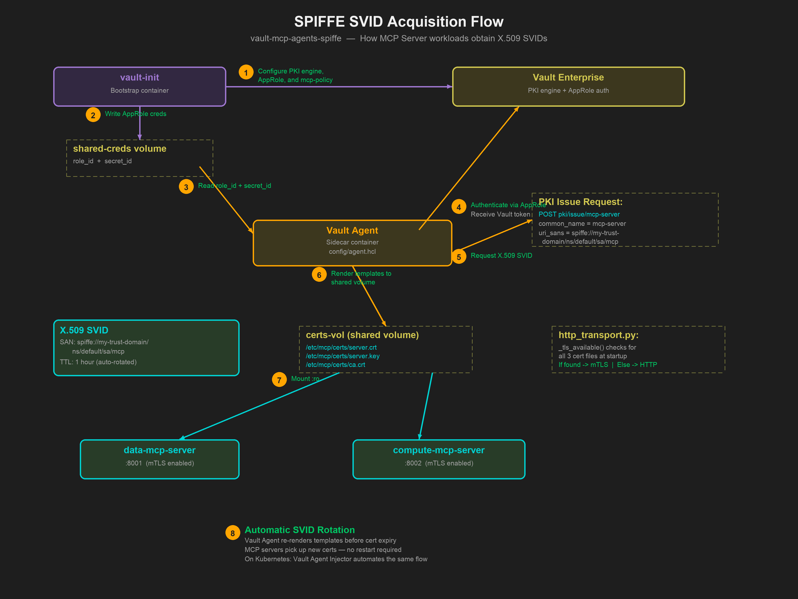
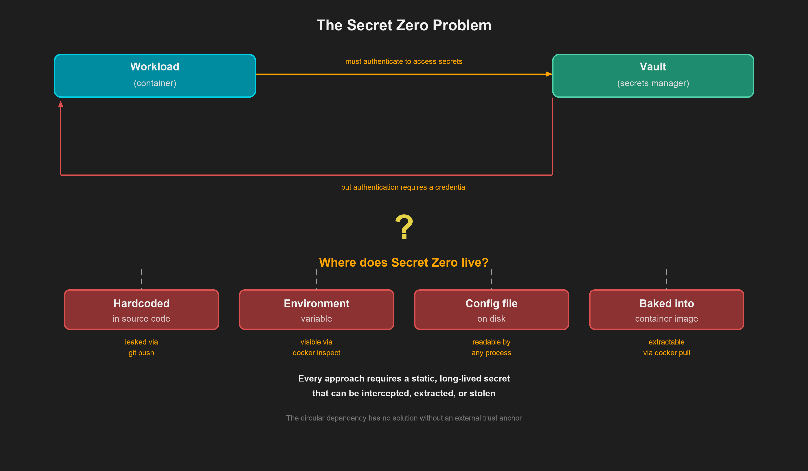

# SPIFFE Workload Identity Guide

This guide explains how SPIFFE (Secure Production Identity Framework for Everyone) is used in this project to provide cryptographic workload identity for MCP server containers, using Vault Agent as a sidecar to mint X.509 SVIDs.

## What is SPIFFE?

SPIFFE is an open standard for securely identifying software systems in dynamic and heterogeneous environments. Instead of relying on network-level trust (IP addresses, firewall rules), SPIFFE gives each workload a cryptographic identity document called an **SVID** (SPIFFE Verifiable Identity Document).

Key concepts:

| Concept | Description |
|---------|-------------|
| **SPIFFE ID** | A URI that uniquely identifies a workload: `spiffe://trust-domain/path` |
| **SVID** | An X.509 certificate (or JWT) that proves a workload's SPIFFE ID |
| **Trust Domain** | A security boundary (like a Kerberos realm): `my-trust-domain` |

## Why SPIFFE in this project?

Without SPIFFE, MCP server containers have no way to cryptographically prove their identity. The SPIFFE URI SAN embedded in each certificate provides:

1. **Mutual TLS (mTLS)** — transport encryption and mutual authentication between services
2. **Workload identity** — each certificate carries a SPIFFE ID that identifies the workload

This adds a **workload identity layer** to the existing defence-in-depth model:

```
┌─────────────────────────────────────────────────┐
│  Layer 1: Human Identity                        │
│  Vault userpass → Session (token + role)         │
├─────────────────────────────────────────────────┤
│  Layer 2: Workload Identity (SPIFFE via Vault)  │
│  Vault Agent → X.509 SVID → mTLS                │
├─────────────────────────────────────────────────┤
│  Layer 3: Application Policy                    │
│  capabilities.yaml → (role, agent) → tools      │
└─────────────────────────────────────────────────┘
```

## How it works: Vault Agent sidecar

Instead of requiring a separate SPIRE infrastructure, this project uses **Vault Agent** as a sidecar to automatically mint and renew X.509 SVIDs using Vault's built-in PKI secrets engine.

### The orchestration flow

```
┌─────────────┐     ┌──────────────────┐     ┌──────────────┐     ┌──────────────┐
│    Vault     │────>│   vault-init     │────>│ Vault Agent  │────>│ MCP Servers  │
│  (healthy)   │     │ (PKI + AppRole)  │     │ (sidecar)    │     │ (mTLS)       │
└─────────────┘     └──────────────────┘     └──────────────┘     └──────────────┘
                     Writes role_id &          Reads creds,         Mounts cert
                     secret_id to              authenticates,       volume, starts
                     shared volume             renders SVIDs        with mTLS
```

The full flow is shown in the diagram below:

<p align="center">
  
</p>

1. **Vault** starts in dev mode and becomes healthy
2. **vault-init** waits for Vault, then:
   - Configures the PKI secrets engine (root CA, SPIFFE-compliant role)
   - Configures AppRole auth with a policy allowing `pki/issue/mcp-server`
   - Writes the AppRole `role_id` and `secret_id` to a shared Docker volume (`/creds/`)
3. **Vault Agent** starts after vault-init completes, then:
   - Reads AppRole credentials from the shared volume
   - Authenticates to Vault via AppRole
   - Uses template blocks to request certificates from `pki/issue/mcp-server`
   - Renders `server.crt`, `server.key`, and `ca.crt` to the certificate volume (`/etc/mcp/certs/`)
4. **MCP Servers** mount the certificate volume and start with mTLS enabled

### No static secrets

Every Vault-based authentication system faces the **Secret Zero** problem: a workload must present a credential to Vault, but where does that first credential come from?

<p align="center">
  
</p>

This project solves Secret Zero by having the `vault-init` container generate fresh AppRole credentials on each `docker compose up` and write them to a shared Docker volume. The Vault Agent reads them once to bootstrap authentication, then uses its Vault token to continuously render certificates. No secrets are baked into container images, and the AppRole `secret_id` is single-use — it cannot be replayed.

## Why the Vault Agent sidecar pattern?

The Vault Agent sidecar is the preferred approach for SVID provisioning because it aligns with the **pull model** that Vault uses for all secret consumption, and it maps directly to the Kubernetes deployment model that is the intended direction of travel.

### Vault is always a pull model

Vault — including Vault Enterprise — never pushes secrets to consumers. Something must always ask Vault for a secret. The three options for who does the asking are:

| Approach | How it works | Trade-offs |
|----------|-------------|------------|
| **Vault Agent sidecar** | A long-running sidecar process authenticates once, then continuously renders and rotates secrets via templates | Handles rotation automatically; maps 1:1 to K8s sidecar injector; application reads files from disk |
| **Init container** | A one-shot container fetches secrets at startup and writes them to a shared volume, then exits | No rotation — if the certificate expires, the workload must restart; acceptable for static secrets but not for short-lived SVIDs |
| **Direct API integration** | The application itself calls the Vault API to fetch and renew secrets | Requires every application to embed Vault client logic; couples application code to Vault; harder to audit and standardise |

For X.509 SVIDs, **certificate rotation is critical**. SVIDs are intentionally short-lived (1-hour default TTL in this project). An init container cannot renew them — the workload would need to restart every hour. The Vault Agent sidecar handles rotation transparently: it watches template outputs and re-renders certificates before they expire.

### Docker Compose as a stepping stone to Kubernetes

The Docker Compose stack in this project manually configures what Kubernetes automates. The mapping is direct:

| Docker Compose (manual) | Kubernetes (automated) |
|--------------------------|------------------------|
| `vault-init` writes AppRole `role_id` / `secret_id` to a shared Docker volume | The Vault Agent Injector admission controller injects credentials automatically |
| `vault-agent` service defined explicitly in `docker-compose.yaml` | Annotation `vault.hashicorp.com/agent-inject: "true"` causes the admission controller to inject the sidecar |
| Certificate volume mounts configured per-service | The injector handles volume mounts and init/sidecar container injection |
| Startup ordering via `depends_on` | Kubernetes handles pod scheduling and container ordering |
| AppRole auth method | Kubernetes auth method (pod service account token) |

By using the same sidecar pattern in Docker Compose, the architecture translates directly to Kubernetes without changing the MCP server code or the certificate consumption model. The MCP servers always read certificates from `/etc/mcp/certs/` regardless of whether a manually configured Vault Agent or an injector-managed sidecar put them there.

### Migrating to Kubernetes auth

When migrating to Kubernetes, configure the Kubernetes auth backend in Vault with a role binding for the MCP server service account. Then:

1. Deploy the Vault Agent Injector into the cluster
2. Annotate MCP server pods with `vault.hashicorp.com/agent-inject` annotations
3. Switch from AppRole to Kubernetes auth (the pod's service account token authenticates to Vault automatically)
4. The same PKI role (`mcp-server`) and policy (`mcp-policy`) work unchanged

## Trust domain configuration

This project uses the trust domain `my-trust-domain`. The SPIFFE ID embedded in the SVID is:

```
spiffe://my-trust-domain/ns/default/sa/mcp
```

This is mapped to agent IDs in `policies/capabilities.yaml`:

```yaml
trust_domain: "vault-mcp-demo"
spiffe_identity_map:
  "spiffe://my-trust-domain/ns/default/sa/mcp": "mcp_server"
```

## PKI configuration

### Root CA

The `vault-init` container creates an internal root CA (`MCP Root CA`) with a 10-year TTL and 4096-bit RSA key. This is the trust anchor for all SVIDs.

### PKI role

The `mcp-server` PKI role allows:

- Common names: `mcp-server`, `localhost`, `svc.cluster.local` (and subdomains)
- SPIFFE URI SANs matching: `spiffe://my-trust-domain/ns/*/sa/*`
- IP SANs (for direct IP access)
- RSA 2048-bit keys with 1-hour default TTL (24-hour max)

### AppRole and policy

The `mcp-policy` Vault policy grants:

```hcl
path "pki/issue/mcp-server" {
  capabilities = ["create", "update"]
}
```

This allows the Vault Agent (authenticated via AppRole) to request certificates from the PKI role.

## Vault Agent configuration

The agent configuration lives at `config/agent.hcl`:

```hcl
auto_auth {
  method "approle" {
    mount_path = "auth/approle"
    config = {
      role_id_file_path   = "/vault/creds/role_id"
      secret_id_file_path = "/vault/creds/secret_id"
    }
  }
}

template {
  destination = "/etc/mcp/certs/server.crt"
  contents = <<EOH
{{- with secret "pki/issue/mcp-server" "common_name=mcp-server" "uri_sans=spiffe://my-trust-domain/ns/default/sa/mcp" -}}
{{ .Data.certificate }}
{{- end }}
EOH
}
```

The agent renders three files:

| File | Content |
|------|---------|
| `server.crt` | X.509 certificate with SPIFFE URI SAN |
| `server.key` | RSA private key |
| `ca.crt` | Issuing CA certificate (for client verification) |

## mTLS in MCP servers

The HTTP transport (`src/vault_mcp_agents/mcp/http_transport.py`) detects certificates at `/etc/mcp/certs/` on startup:

- **Certs present:** Server starts with mTLS (TLS + client certificate verification)
- **No certs:** Server starts in plain HTTP mode (local development)

This is automatic — no configuration changes needed between environments.

## Verifying the SVIDs

After running `docker compose up`, verify the certificates:

```bash
# Check files exist
docker exec data-mcp-server ls -l /etc/mcp/certs/

# Verify the SPIFFE URI SAN
docker exec data-mcp-server openssl x509 \
    -in /etc/mcp/certs/server.crt -text -noout | grep "URI"
```

Expected output:

```
URI:spiffe://my-trust-domain/ns/default/sa/mcp
```

## Troubleshooting

### Certificates not appearing

The Vault Agent may not have started or authenticated yet:

1. Check Vault Agent logs: `docker compose logs vault-agent`
2. Verify vault-init completed: `docker compose logs vault-init`
3. Check that AppRole credentials exist: look for `role_id` and `secret_id` in the `shared-creds` volume

### "Permission denied" from Vault Agent

The AppRole token does not have the `mcp-policy`. Verify:

```bash
export VAULT_ADDR=http://localhost:8200
export VAULT_TOKEN=dev-root-token

vault read auth/approle/role/mcp-role
vault read sys/policy/mcp-policy
```

### Certificate verification fails

The CA certificate does not match. This can happen if Vault was restarted without clearing volumes:

```bash
docker compose down -v  # Remove all volumes
docker compose up       # Fresh start
```

### mTLS not enabled on MCP servers

Check the MCP server logs for the startup message:

```bash
docker compose logs data-mcp-server | grep -i "svid\|mtls\|http"
```

If you see "No SVID certificates" the cert volume may not be mounted or the agent hasn't rendered certs yet.
